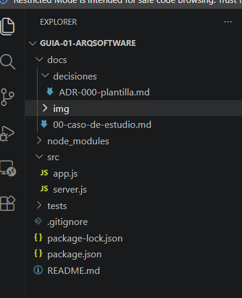

# arq-citas-salud

Proyecto de la **Guía 01: Configuración del entorno, repositorio y caso de estudio**.

## Datos del estudiante
- **Nombre completo:** HUAMANI TUDELANO JHON SAMUEL
- **Código:** 27171301

## Docente
- Ing. Lizbeth Jaico Quispe

## Descripción del curso
IS-488 Arquitectura de Software (semestre 2026-II, UNSCH). El curso estudia cómo se toman y documentan
las decisiones que definen la estructura de un sistema: componentes, relaciones y atributos de calidad como
seguridad, rendimiento, disponibilidad, escalabilidad y mantenibilidad.

## Expectativas respecto al curso
## Expectativas respecto al curso
Espero aprender a pensar un sistema antes de programarlo: identificar sus componentes principales,
cómo se relacionan y qué atributos de calidad (seguridad, disponibilidad, mantenibilidad) importan más
en cada caso. Quiero saber justificar por qué elijo una estructura y no otra, y dejar esas decisiones
documentadas en el propio repositorio mediante ADR.

También espero mejorar mi trabajo en equipo con Git y GitHub (ramas, Pull Requests y Conventional
Commits) y terminar el semestre con un proyecto integrador que pueda explicar línea por línea. Por último,
quiero llegar al laboratorio 11 con Docker ya instalado y funcionando.

## Evidencias

### Paso 1: verificación de versiones


### Paso 2: configuración de identidad en Git


## Estructura del proyecto
```
arq-citas-salud/
├── docs/
│   ├── 00-caso-de-estudio.md
│   ├── decisiones/
│   │   └── ADR-000-plantilla.md
│   └── img/                 # capturas del README
├── src/
│   ├── app.js               # define la aplicación Express
│   └── server.js            # arranca el servidor
├── tests/
├── .gitignore
├── README.md
├── package.json
└── package-lock.json
```

## Cómo ejecutar
```bash
npm install
npm run dev      # con nodemon (reinicia al guardar)
npm start        # ejecución normal
```
Luego abrir http://localhost:3000 y http://localhost:3000/health

## Convenciones de trabajo
- **main:** código estable; solo recibe cambios mediante Pull Request revisado.
- **developer:** integración del trabajo del equipo.
- **feature/nombre:** una rama por funcionalidad, que se integra en developer.
- **Conventional Commits:** `tipo(alcance): descripción`, por ejemplo `feat(citas): agregar endpoint de reserva`.

## ¿Por qué esta estructura ya es una decisión arquitectónica?
Separar `app.js` (qué hace la aplicación) de `server.js` (cómo se ejecuta) desacopla la lógica del arranque,
lo que facilita las pruebas y el crecimiento por capas. Las carpetas `docs/` y `tests/` reservan desde el
primer día un lugar para documentar decisiones y verificar el sistema.
